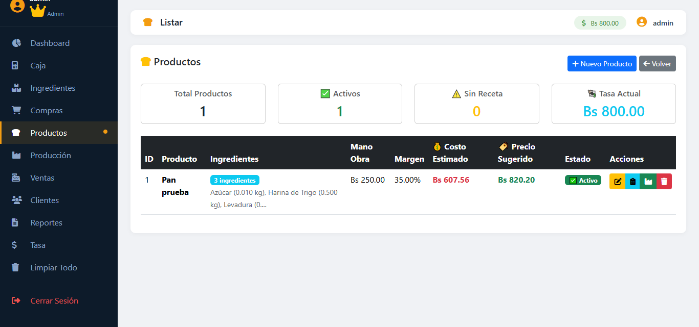
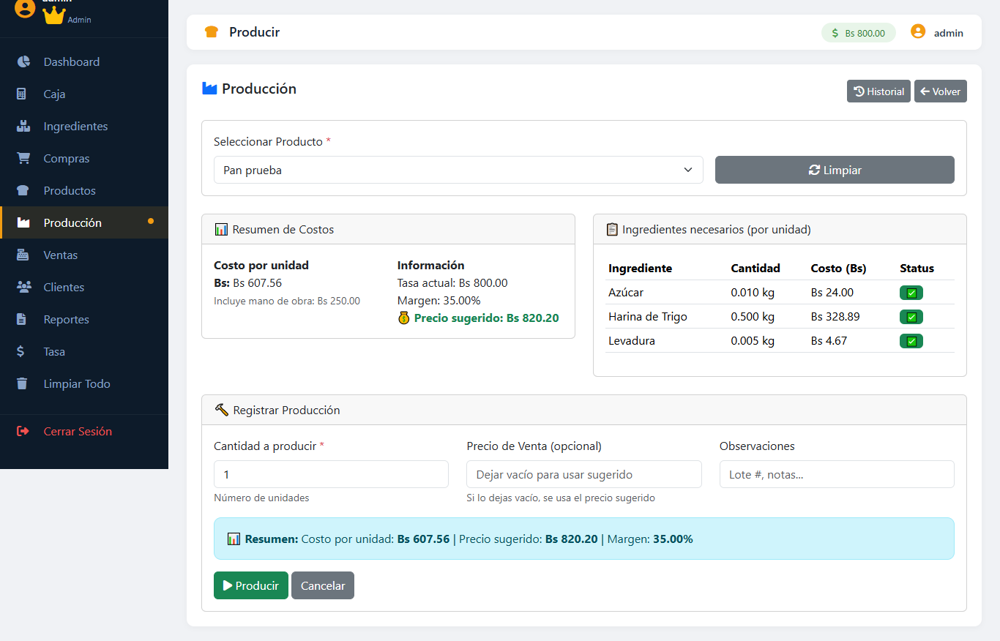

# 🥖 Sistema de Panadería

  
  
  

> **⚠️ AVISO:** Este es un proyecto **privado**. El código no está disponible. Este README es solo para documentación.

---

## 📋 ¿Qué es esto?

Sistema CRUD que mi papá usa en su panadería para:
- Calcular costos de producción
- Calcular margen de ganancia
- Sugerir precios de venta según ingredientes
- Registrar ganancias y pérdidas

**Es un proyecto REAL.** Alguien lo usa todos los días para tomar decisiones de negocio.

---

## 🖥️ Interfaz

*(Agrega aquí fotos de la interfaz)*

> **Nota:** Las imágenes son referencias visuales, el código es privado.

---

Costo total = Suma de (cantidad_ingrediente × precio_ingrediente)
Costo por unidad = Costo total / cantidad_producida
Precio sugerido = Costo por unidad × (1 + margen_ganancia)

text

### Ejemplo práctico:

| Ingrediente | Cantidad | Precio | Subtotal |
|-------------|----------|--------|----------|
| Harina | 1 kg | $1.00 | $1.00 |
| Levadura | 10g | $0.10 | $0.10 |
| Sal | 5g | $0.02 | $0.02 |
| **Total** | | | **$1.12** |

Si se producen 10 panes:
- Costo por pan: $0.112
- Con 30% de ganancia: $0.15 → **$0.15 por pan**

---

## 🛠️ Tecnologías

---

## 📊 Funcionalidades

| Módulo | Descripción |
|--------|-------------|
| 📦 Productos | Gestionar ingredientes y precios |
| 🧮 Fórmulas | Crear recetas con cantidades |
| 💰 Ventas | Registrar ventas diarias |
| 📈 Reportes | Ver ganancias y pérdidas |

---

## 🖥️ Infraestructura

Corre en mi **servidor local** con:
- Linux + Apache + MySQL + PHP (LAMP)
- Acceso vía Samba para editar desde Windows
- Administrado con Cockpit

---

## 📝 Lecciones Aprendidas

1. **Los sistemas reales son los que más enseñan**
2. **La lógica de negocio es más compleja que el código**
3. **Mi papá confía en mí para su negocio - eso vale oro**
4. **Un CRUD simple puede resolver problemas complejos**

---

*"Hecho para mi papá - Construido con ❤️ desde Venezuela"*

## 🧠 Lógica de Negocio

### Cálculo de Precios

El sistema calcula el precio de venta basado en:
